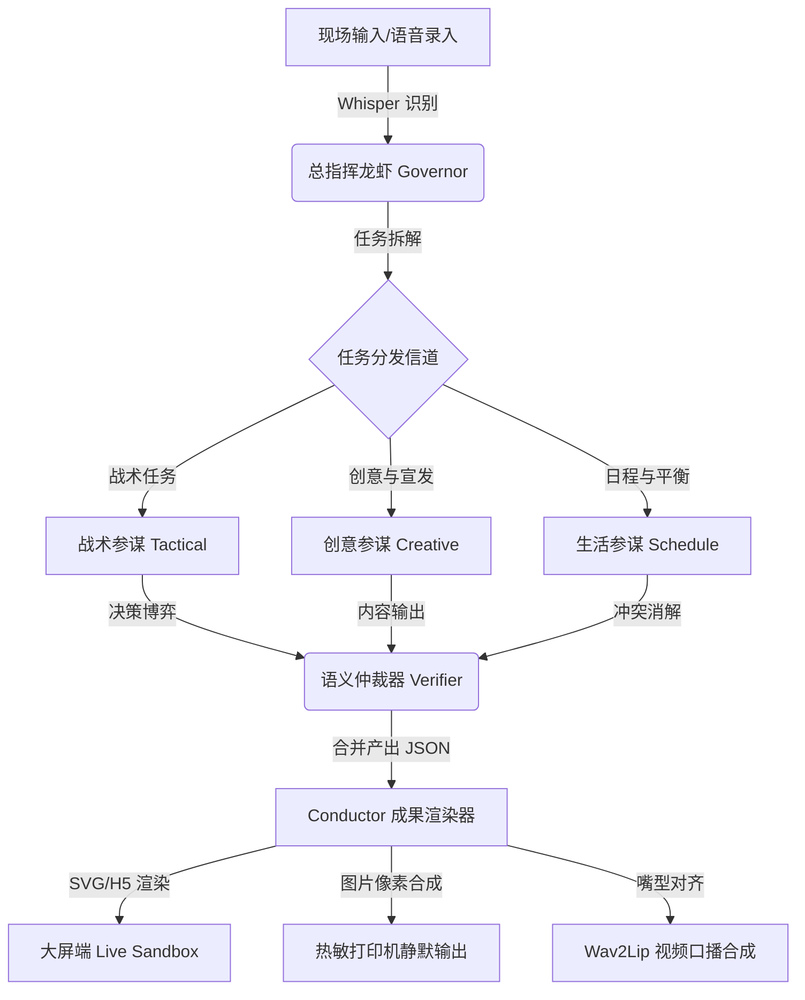

# 🦞 Longxia (龙虾特战队) 

> **GeForce RTX 5090 本地算力全程驱动的“全栈个人专属智能体极限协同网络”**

[](https://www.python.org/)
[](LICENSE)
[](https://www.nvidia.com/)
[](https://github.com/wind-chaser-github/longxia)

Longxia（龙虾特战队）是一个面向硬核科技场景的高性能多智能体（Multi-Agent）协同推演网络。本项目旨在打破“单线程问答机器人”的传统限制，在 **GeForce RTX 5090 本地算力** 的强力驱动下，实现多个职能高度分化的本地 Agent 自主分工、语义博弈与物理级成果输出（如实体工牌秒级打印、离线人声合成与口型驱动）。

---

## 🛠️ 系统架构与拓扑

Longxia 依托底层的 **Conductor 编排引擎**，实现了智能体的并发调度与语义博弈。以下是系统在执行复杂任务时的解耦推演拓扑图：



---

## 🌟 已实现核心基础能力

*   **⚡️ Conductor 多智能体编排引擎**：底层自主研发的 Agent 调度引擎，支持总指挥（Governor）向下拆解任务，并在不同职能参谋间建立串/并行的执行流与状态机同步。
*   **🧠 本地与云端异构算力融合**：原生支持离线部署大语言模型（如基于 Ollama 的 Qwen-2.5-72B-Instruct / Llama-3），同时兼容调用 OpenAI / Anthropic 等云端闭源模型接口，保障全断网环境下的极限可用性。
*   **🛠️ 专家化 Skill 与工具链插拔**：每个职能 Agent 采用 YAML 配置高度解耦，支持热插拔自定义系统提示词、专业级 Skills 及外接 API 工具集，实现功能能力的水平扩展。
*   **📡 实时 Trace 链路全双工通讯**：内置 WebSockets 通讯与前端监控探针，毫秒级推送底层 Agent 的思维链（Chain of Thought）、状态迁跃和模块间博弈日志，使得 AI 的思考路径在大屏端完全白盒可视。

---

## 🚀 快速开始

### 1. 克隆项目与安装环境
```bash
git clone git@github.com:wind-chaser-github/longxia.git
cd longxia/longxia-core
pip install -r requirements.txt
```

### 2. 配置本地环境变量
在 `longxia-core/` 目录下创建 `.env` 文件，并参考 `.env.example` 配置您的本地大模型服务终结点与 API 密钥：
```env
LOCAL_LLM_API_BASE="http://localhost:11434/v1"  # 本地 Ollama/LM Studio 端口
LOCAL_LLM_MODEL="qwen2.5:72b-instruct"
TTS_ENGINE_PATH="/path/to/GPT-SoVITS"
WAV2LIP_MODEL_PATH="/path/to/Wav2Lip/checkpoints"
```

### 3. 启动本地专家协同服务
```bash
python src/server/main.py
```

### 4. 运行前端 UI
```bash
cd ui
npm install
npm run dev
```

---

## 🤝 参与贡献

我们非常欢迎并感谢您为 Longxia 提交任何 Issue 或 Pull Request！在开始参与开发前，请务必阅读 [CONTRIBUTING.md](CONTRIBUTING.md) 以了解我们的代码规范。

---

## 📄 开源许可证

本项目基于 [MIT](LICENSE) 许可证开源。
