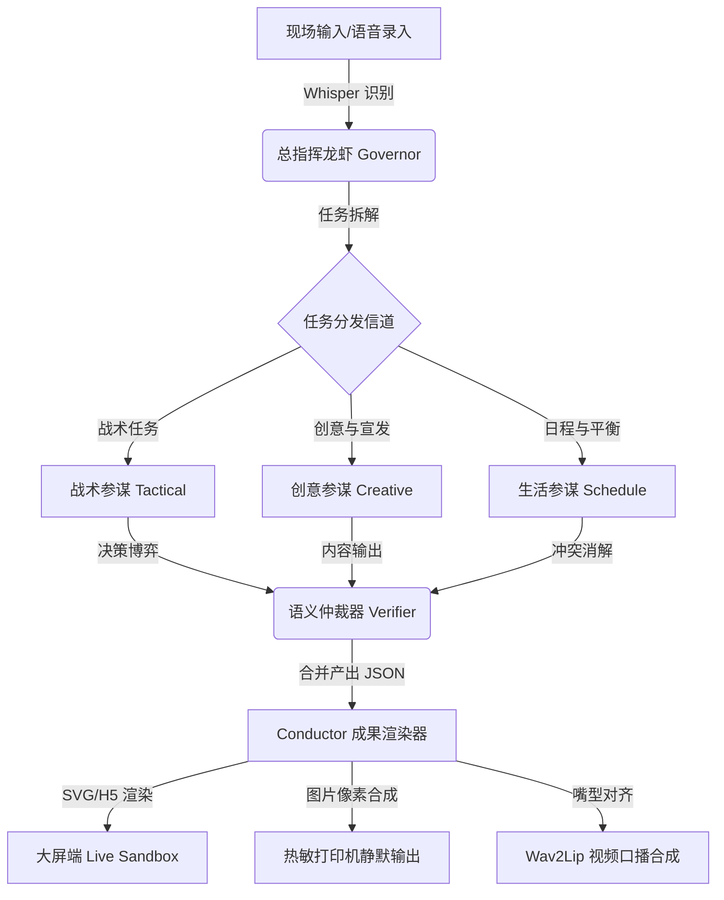

# 🦞 Longxia (龙虾特战队) 

> **GeForce RTX 5090 本地算力全程驱动的“全栈个人专属智能体极限协同网络”**

[](https://www.python.org/)
[](LICENSE)
[](https://www.nvidia.com/)
[](https://github.com/wind-chaser-github/longxia)

Longxia（龙虾特战队）是一个面向硬核科技场景的高性能多智能体（Multi-Agent）协同推演网络。本项目旨在打破“单线程问答机器人”的传统限制，在 **GeForce RTX 5090 本地算力** 的强力驱动下，实现多个职能高度分化的本地 Agent 自主分工、语义博弈与物理级成果输出（如实体工牌秒级打印、离线人声合成与口型驱动）。

---

## 🛠️ 系统架构与拓扑

Longxia 依托底层的 **Conductor 编排引擎**，实现了智能体的并发调度与语义博弈。以下是系统在执行复杂任务时的解耦推演拓扑图：



---

## 🌟 核心功能模块 (点击展开详情)

<details>
<summary><b>🎮 1. 大屏端拆解式可视化沙盘 (点击展开)</b></summary>
<br>

*   **智能体分窗博弈**：主舞台大屏幕采用多窗口分屏排版，实时展示各龙虾参谋在接收到任务后的拆解、反驳、修正的语义流。
*   **状态机控制**：卡片卡色根据 Agent 当前所处的状态（思考中、生成中、被驳回、最终采纳）动态闪烁，呈现极强的视觉冲击力。
*   **敏感词前置拦截**：内置高性能本地敏感词过滤机制，在保障现场全自由文本输入的同时，确保舞台展示的绝对合规。

</details>

<details>
<summary><b>💳 2. 专属「极限测评官」实体工牌打印 (点击展开)</b></summary>
<br>

*   **热敏物理防糊算法**：由于热敏打印物理上只能显现单色且高热容易导致纸张变形，系统会对合成图像自动进行**“半色调网点（Halftone Dots）”**优化，禁止大色块加热，确保线条与字迹边缘清晰。
*   **秒级静默出纸**：Python 后端通过 `lpr` 系统打印池与热敏打印机直连，在生成工牌 PNG 的瞬间，触发物理出纸，整个过程在 **3秒内** 完成。

</details>

<details>
<summary><b>🎬 3. AI-GenJi 虚拟人出镜与危机公关 (点击展开)</b></summary>
<br>

*   **1.5秒声音克隆**：本地离线部署 `GPT-SoVITS` 引擎，基于 5 分钟的 Reference Audio 样本，可在 1.5 秒内极速生成语气自然的 GenJi 语音。
*   **极速口型视频合成**：本地部署 `Wav2Lip` 嘴部驱动，仅针对前 5 秒的绿幕视频底片进行像素级嘴部贴合，随后自动过渡到话术 PPT 大板，完美解决本地实时视频生成耗时长的硬伤，把舞台等待时间控制在 10 秒以内。

</details>

<details>
<summary><b>📅 4. 日程消解与线上会议生成 (点击展开)</b></summary>
<br>

*   **5秒无冲突编排**：由生活参谋调用大模型进行多任务时间冲突消解，生成标准的 SVG 行程卡大图。
*   **会议与地图接口**：自动对接腾讯会议/钉钉 API 生成真实会议链接（断网时回退为本地 Mock）；路程计算可无缝回退到本地静态经纬度 Excel 矩阵进行离线测算，防范现场断网。

</details>

<details>
<summary><b>🌐 5. 扫码带走与云端同步 (点击展开)</b></summary>
<br>

*   **OSS 异步同步**：5090 本地生成的网页与工牌大图，在后台毫秒级异步同步上传至云端对象存储（OSS/COS）。
*   **扫码即开**：二维码印在工牌上或投影在大屏上，观众手机扫码时直接通过其移动蜂窝网络访问公网链接，彻底摆脱展馆现场局域网 Wi-Fi 信号拥堵导致的白屏问题。

</details>

---

## 🚀 快速开始

### 1. 克隆项目与安装环境
```bash
git clone git@github.com:wind-chaser-github/longxia.git
cd longxia/longxia-core
pip install -r requirements.txt
```

### 2. 配置本地环境变量
在 `longxia-core/` 目录下创建 `.env` 文件，并参考 `.env.example` 配置您的本地大模型服务终结点与 API 密钥：
```env
LOCAL_LLM_API_BASE="http://localhost:11434/v1"  # 本地 Ollama/LM Studio 端口
LOCAL_LLM_MODEL="qwen2.5:72b-instruct"
TTS_ENGINE_PATH="/path/to/GPT-SoVITS"
WAV2LIP_MODEL_PATH="/path/to/Wav2Lip/checkpoints"
```

### 3. 启动本地专家协同服务
```bash
python src/server/main.py
```

### 4. 运行前端 UI
```bash
cd ui
npm install
npm run dev
```

---

## 🤝 参与贡献

我们非常欢迎并感谢您为 Longxia 提交任何 Issue 或 Pull Request！在开始参与开发前，请务必阅读 [CONTRIBUTING.md](CONTRIBUTING.md) 以了解我们的代码规范。

---

## 📄 开源许可证

本项目基于 [MIT](LICENSE) 许可证开源。
