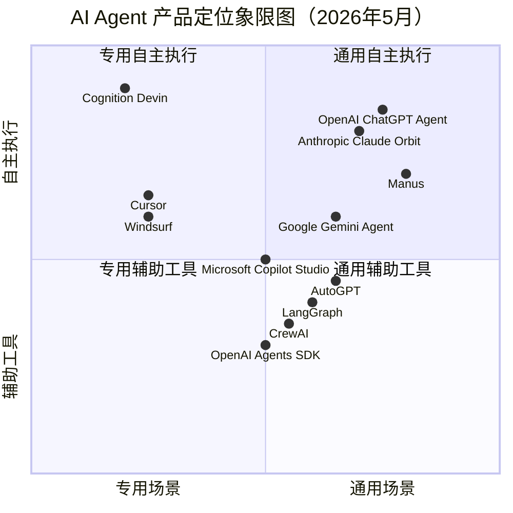

# AI Agent 市场调研报告

> 调研时间：2026年5月
> 调研范围：全球主流 AI Agent 产品市场现状与趋势

---

## 一、执行摘要

AI Agent（智能体）正经历从"对话工具"到"自主执行体"的范式跃迁。2025-2026年，行业进入爆发期：**全球市场规模已达约80亿美元**，预计到2030年将突破520亿美元（CAGR约46%）。本报告覆盖7个最具代表性的AI Agent产品，涵盖通用Agent、编程Agent、开源框架三大类别，梳理其技术架构、商业模式与最新动态，并分析行业发展趋势。

**核心发现：**
- OpenAI、Anthropic、Google 三巨头全面进入 Agent 赛道，从对话走向行动
- AI 编程 Agent 成为最成熟的商业化方向，Cursor 估值达 293亿美元
- 开源生态繁荣，LangGraph/CrewAI 等框架进入生产级阶段
- 中国 Manus 在全球爆红后引发地缘政治博弈，被中国政府叫停 Meta 收购
- Agent 正从"被动响应"向"主动服务"演进（Anthropic Orbit 概念）

---

## 二、AI Agent 市场概览

### 2.1 市场规模

| 指标 | 数据 | 来源 |
|------|------|------|
| 2024年市场规模 | ~59亿美元 | GMInsights |
| 2025年市场规模 | ~78-83亿美元 | MarketsandMarkets / TBR |
| 2030年预测规模 | ~526亿美元 | MarketsandMarkets |
| 2034年预测规模 | ~2514亿美元 | Fortune Business Insights |
| CAGR（2025-2034） | 38.5% - 46.3% | 多家机构综合 |

### 2.2 市场驱动力

1. **大模型能力突破**：GPT-o3、Claude Opus 4.7、Gemini 3 等模型的推理能力大幅提升
2. **企业数字化转型**：超60%企业计划部署AI Agent（预计2026年）
3. **Agent 框架成熟**：LangGraph 1.0、CrewAI Enterprise 等降低开发门槛
4. **编程场景率先落地**：AI编程工具实现商业化突破，驱动行业信心
5. **多模态能力增强**：Computer Use、视觉理解等使Agent能"看"和"操作"

---

## 三、顶级 AI Agent 产品深度分析

### 3.1 OpenAI — Operator / ChatGPT Agent

**产品名称：** Operator（2025年1月发布）→ ChatGPT Agent（2025年7月整合升级）

**核心能力与定位：** OpenAI 首款通用 AI Agent，能在浏览器中自主执行任务——点击、滚动、填写表单、跨网站操作。2025年7月升级为 ChatGPT Agent，整合了 Operator（网页交互）+ Deep Research（信息整合）+ ChatGPT（对话）的"三位一体"能力。

**技术架构：**
- 底层模型：GPT-4o → 2025年5月升级至 o3 推理模型，任务成功率提升35%
- Computer-Using Agent（CUA）模型架构
- 支持多模态（文本、图像、网页）
- 闭源，通过 ChatGPT 平台交付
- 2025年发布开源 Agents SDK（Python），支持多Agent编排

**目标用户群体：** ChatGPT Pro 用户（$200/月）及企业客户

**商业模式：**
- ChatGPT Pro 订阅制（$200/月）
- API 调用按量计费
- Agents SDK 开源免费

**最新动态：**
- 2025年1月：发布 Operator，首个浏览器操作 Agent
- 2025年5月：底层模型从 GPT-4o 升级至 o3
- 2025年7月：发布 ChatGPT Agent，整合 Operator + Deep Research
- 2025年：发布 Agents SDK 开源框架，GitHub 23,200+ stars
- 2025年11月：Copilot Studio 集成 GPT-5 Chat

**优势：**
- 全球最大的 AI 生态系统与用户基础
- o3 推理模型带来行业领先的任务完成率
- 整合多种工具形成统一入口

**局限：**
- 高端功能仅限 $200/月 Pro 用户
- 浏览器操作场景仍有安全与稳定性挑战
- 闭源模型，定制化受限

---

### 3.2 Anthropic — Claude Computer Use / Orbit

**产品名称：** Claude Computer Use（2024年10月Beta） / Orbit（2026年5月曝光）

**核心能力与定位：** Anthropic 的 Agent 战略分两条线：Computer Use 让 Claude 能像人一样操控电脑（截图+鼠标键盘），而最新曝光的 Orbit 则代表从"被动响应"到"主动服务"的范式转变——Claude 能在后台持续运行，主动从 Gmail、Slack、GitHub 等读取数据并替用户完成任务。

**技术架构：**
- 底层模型：Claude 3.5 Sonnet → Claude 4 系列（Haiku 4.5 / Opus 4.7 / Sonnet 4.6）
- Claude Opus 4.7（2026年4月）为最新旗舰，长任务 Agent 能力显著增强
- Computer Use：视觉推理 + 坐标映射 + API 驱动
- Orbit：后台持续运行 + 多平台数据整合 + 主动推理
- 闭源，提供 API 与 Web/Mobile 客户端

**目标用户群体：** 开发者（API）、企业客户、个人用户

**商业模式：**
- API 按量计费
- Claude Pro 订阅（$20/月）
- Claude Max/Team 企业订阅

**最新动态：**
- 2024年10月：发布 Computer Use Beta（Claude 3.5 Sonnet）
- 2025年11月：发布 Claude Haiku 4.5
- 2026年2月：发布 Claude Opus 4.6 / Sonnet 4.6
- 2026年4月：发布 Claude Opus 4.7 旗舰模型，Agent 能力大幅升级
- 2026年5月：Orbit 主动助手功能泄露曝光，引发行业震动
- 2026年5月：举办 Code with Claude 开发者大会

**优势：**
- Claude Opus 4.7 在编码和长任务 Agent 上表现行业领先
- Computer Use 技术方案成熟，开发者生态完善
- Orbit 概念引领"主动AI助手"新范式

**局限：**
- Computer Use 仍存在操作精准度和速度问题
- Orbit 仍在测试阶段，尚未正式发布
- 后台持续运行对基础设施要求极高

---

### 3.3 Google — Gemini Agent / Project Mariner（已停运）

**产品名称：** Project Mariner（2024年12月发布，2026年5月停运）→ Gemini Agent / AI Mode

**核心能力与定位：** Google 的 Agent 布局经历了从独立实验项目到核心产品整合的过程。Project Mariner 曾是跨网页多任务自动化工具，但已于2026年5月4日正式停运，核心技术迁移至 Gemini Agent 和 AI Mode。

**技术架构：**
- 底层模型：Gemini 系列（最新 Gemini 3 Pro Preview，2025年11月）
- AI Mode：搜索增强的 Agent 模式
- Gemini Agent Mode：多步骤任务编排（代码重构、跨文件操作等）
- 支持多模态（文本、图像、视频、音频）
- 闭源，集成于 Google 生态

**目标用户群体：** Google 生态用户、企业客户、开发者

**商业模式：**
- Google AI Ultra 订阅
- Google Cloud 企业服务
- 面向开发者的 ADK（Agent Development Kit）

**最新动态：**
- 2024年12月：发布 Project Mariner
- 2025年5月：Google I/O 2025 大会重点展示 Agent 战略
- 2025年9月：Agent Mode 在 Google AI Ultra 中上线
- 2025年11月：发布 Gemini 3 Pro Preview，定位最强 Agent 编排模型
- 2026年5月：Project Mariner 正式停运，技术整合至 Gemini Agent 和 AI Mode

**优势：**
- 拥有全球最大的搜索与数据生态
- Gemini 3 多模态能力领先
- Agent 与搜索、办公套件深度整合

**局限：**
- Project Mariner 停运反映产品策略摇摆
- Agent 产品化程度落后于 OpenAI 和 Anthropic
- 生态封闭，与第三方整合有限

---

### 3.4 Microsoft — Copilot Studio

**产品名称：** Microsoft Copilot Studio

**核心能力与定位：** 微软的企业级低代码/无代码 AI Agent 构建平台。用户无需编程即可创建、部署和管理自定义 AI Agent，支持与 Microsoft 365、Dynamics 365、Power Platform 等深度集成。

**技术架构：**
- 底层模型：支持 GPT-4o、GPT-5、Claude 等多模型
- 多 Agent 编排（2025年11月 GA）
- M365 Agents SDK + 开放 Agent-to-Agent 协议
- Human-in-the-loop 治理与安全控制
- 闭源平台，低代码界面

**目标用户群体：** 企业IT部门、业务分析师、开发者

**商业模式：**
- Microsoft 365 Copilot 附加订阅
- Power Platform 许可证体系
- 企业级按席位计费

**最新动态：**
- 2025年8月：Copilot Studio 与 M365 Copilot Agents 大幅更新
- 2025年11月：Wave 2 更新，无代码 Agent 创建 + 多Agent编排 GA
- 2025年11月：集成 GPT-5 Chat 能力
- 2025年12月：Agent 治理 + Human-in-the-loop 安全控制增强
- 2025年：多 Agent 编排在 Microsoft Fabric、M365 Agents SDK 中 GA

**优势：**
- 深度绑定 Microsoft 365 企业生态，壁垒极高
- 低代码/无代码，业务人员可上手
- 多Agent编排 + 企业级安全治理完善

**局限：**
- 严重依赖 Microsoft 生态，跨平台能力弱
- 灵活性不如开源框架
- Agent 智能度受限于底层模型选择

---

### 3.5 Cursor — AI 编程 IDE

**产品名称：** Cursor

**核心能力与定位：** 当前全球最火热的 AI 编程工具，基于 VS Code 深度定制的 AI 原生 IDE。提供代码生成、智能补全、多文件编辑、Agent 模式等全链路 AI 编程能力，已成为开发者首选 AI 编程环境。

**技术架构：**
- 自研模型 + 多模型支持（Claude、GPT等）
- 多Agent代码架构
- 深度集成 VS Code 生态
- 支持多种编程语言
- 闭源商业产品

**目标用户群体：** 软件开发者、开发团队

**商业模式：**
- Free / Pro ($20/月) / Business ($40/月)
- 企业定制方案

**最新动态：**
- 2025年：用户量与收入快速增长
- 2025年6月：估值从39亿升至99亿美元
- 2025年11月：完成23亿美元D轮融资，估值达293亿美元
- 投资方包括 Accel、Thrive、a16z、NVIDIA、Google
- 年化收入（ARR）突破10亿美元
- 持续迭代多Agent代码架构

**优势：**
- AI编程赛道绝对龙头，生态最完善
- 293亿美元估值反映市场最高认可
- ARR突破10亿美元，商业模式已验证
- NVIDIA、Google 等顶级背书

**局限：**
- 估值极高，增长压力巨大
- 面临 Windsurf（Cognition生态）、GitHub Copilot 等激烈竞争
- 依赖第三方模型，底层模型成本是变量

---

### 3.6 Cognition — Devin / Windsurf

**产品名称：** Devin（AI软件工程师） + Windsurf（AI编程IDE）

**核心能力与定位：** Cognition AI 旗下两大产品形成完整AI编程生态。Devin 定位"全球首个全自动AI软件工程师"，可自主完成端到端软件开发任务。Windsurf（原Codeium）是AI原生IDE，2025年7月被Cognition收购后整合。两者覆盖从IDE辅助到全自动开发的全场景。

**技术架构：**
- Devin：自研模型 + 全自主开发能力（环境搭建→编码→调试→部署）
- Windsurf：Cascade Agent 工作流 + AIFlow + SWE-1.5 模型
- 支持BYOK（自选模型）+ Git Worktrees + 多Agent并行
- 闭源商业产品

**目标用户群体：** 软件开发者、企业开发团队

**商业模式：**
- Devin：按任务/订阅计费
- Windsurf：Free / Pro / Enterprise
- 企业定制方案

**最新动态：**
- 2025年7月：Cognition 收购 Windsurf，历经72小时收购大战
- 2025年9月：完成4亿美元融资，投后估值102亿美元（Founders Fund 领投）
- 2026年4月：据报正在洽谈新一轮融资，目标估值250亿美元
- Windsurf整合SWE-1.5模型，Cascade Agent能力大幅增强
- 形成 Devin（全自动）+ Windsurf（IDE辅助）双产品矩阵

**优势：**
- Devin全自动开发能力独一无二
- 收购Windsurf后形成IDE+Agent完整生态
- 华人创始团队（Scott Wu，IOI金牌），技术实力顶尖
- 估值增长极快，资本市场高度认可

**局限：**
- Devin全自动模式可靠性仍需提升
- 与Cursor的竞争白热化
- 收购Windsurf后的产品整合仍在进行中
- 估值过高带来的泡沫风险

---

### 3.7 Manus — 通用AI Agent（中国）

**产品名称：** Manus

**核心能力与定位：** 被称为"全球首款通用AI智能体"，由中国初创公司蝴蝶效应（注册于新加坡）开发。能自主执行复杂的多步骤任务，包括数据分析、文档生成、网页操作等。2025年3月凭借演示视频在全球爆红，被誉为"中国AI的又一里程碑"。

**技术架构：**
- 基于多模型架构
- 通用Agent框架，任务覆盖面广
- 虚拟环境执行（沙箱）
- 闭源商业产品

**目标用户群体：** 个人用户、企业用户

**商业模式：**
- 免费体验 + 订阅制

**最新动态：**
- 2025年3月：产品上线后迅速爆红全球，被称为"第二个DeepSeek时刻"
- 2025年12月30日：Meta宣布以约20亿美元全资收购母公司蝴蝶效应
- 2026年4月27日：中国国家发改委叫停收购案，要求"撤销交易"
- 2026年5月：收购正式被禁止，成为中国首个被叫停的AI外资收购案
- Manus官网仍显示"已成为Meta的一部分"，但交易已无效
- 产品后续发展存不确定性

**优势：**
- 全球首款通用Agent产品概念，先发优势
- 中国AI技术实力的又一证明
- 多步骤任务执行能力出色

**局限：**
- Meta收购被叫停，未来发展路径不明
- 与OpenAI/Anthropic在模型能力上仍有差距
- 幻觉控制、交付物友好度有待改进
- 3个月战略窗口期已过，竞争加剧

---

## 四、开源 Agent 框架生态

### 4.1 LangGraph（LangChain）

| 维度 | 详情 |
|------|------|
| 开发方 | LangChain 团队 |
| 定位 | 低层级 Agent 编排框架，提供持久化执行、状态管理、多Agent协作 |
| 最新版本 | LangGraph 1.0 正式版（2025年10月发布） |
| 核心特性 | 持久化Agent、记忆管理、MCP支持、护栏机制、多Agent编排 |
| 开源协议 | MIT |
| Stars | 23,200+（截至2026年） |
| 适用场景 | 生产级Agent应用、复杂工作流、企业级部署 |

### 4.2 CrewAI

| 维度 | 详情 |
|------|------|
| 开发方 | CrewAI Inc. |
| 定位 | 多Agent协作框架，模拟真实团队分工协同 |
| 最新版本 | CrewAI Enterprise（2024年10月发布） |
| 核心特性 | 角色分配、任务管理、信息共享、企业级托管部署 |
| 融资 | 1800万美元（2024年10月） |
| 开源协议 | 开源核心 + 企业版付费 |
| 适用场景 | 多Agent团队协作、企业级多智能体系统 |

### 4.3 OpenAI Agents SDK

| 维度 | 详情 |
|------|------|
| 开发方 | OpenAI |
| 定位 | 轻量级多Agent编排框架，Swarm的生产级升级 |
| 最新版本 | 持续更新中 |
| 核心特性 | Agent/Handoff/Guardrail三大原语、沙箱执行、100+ LLM支持 |
| Stars | 23,200+（截至2026年4月） |
| 开源协议 | MIT |
| 适用场景 | 基于OpenAI模型的Agent开发、快速原型 |

### 4.4 AutoGPT

| 维度 | 详情 |
|------|------|
| 开发方 | Significant Gravitas |
| 定位 | 最早的自主Agent项目之一，2023年即引爆概念 |
| 最新版本 | AutoGPT Platform（可视化构建器，2025年11月） |
| 核心特性 | 可视化Agent构建、自主任务执行 |
| Stars | GitHub历史最高Star项目之一 |
| 开源协议 | 开源 |
| 适用场景 | 实验、概念验证、非生产环境 |

---

## 五、AI Agent 产品定位象限图

**象限解读：**
- **右上（通用自主执行）：** OpenAI ChatGPT Agent、Anthropic Claude Orbit、Manus — 追求全场景自主Agent
- **左上（专用自主执行）：** Devin、Cursor — 深耕编程领域的自主Agent
- **左下（专用辅助工具）：** Windsurf、Copilot Studio — 面向特定场景的辅助型Agent
- **右下（通用辅助/框架）：** LangGraph、CrewAI、Agents SDK — 为Agent开发提供基础设施

---

## 六、AI Agent 发展趋势分析

### 6.1 技术演进趋势

1. **从"被动响应"到"主动服务"**
   - Anthropic Orbit 引领新范式：AI不再等用户发指令，而是7x24小时后台运行，主动读取数据并完成任务
   - OpenAI ChatGPT Agent 整合多种工具实现自主选择最优方案

2. **推理能力大幅提升**
   - OpenAI o3、Claude Opus 4.7、Gemini 3 Pro 等新模型显著增强Agent的决策质量
   - Operator 升级o3后任务成功率提升35%

3. **多模态Agent成为标配**
   - Computer Use（Anthropic）、CUA（OpenAI）让Agent能"看屏幕、点鼠标"
   - 视觉理解 + 操作执行 = 更通用的Agent能力

4. **多Agent协作成熟**
   - Microsoft Copilot Studio 多Agent编排 GA
   - CrewAI 模拟团队协作，LangGraph 支持复杂多Agent工作流

5. **框架生产化**
   - LangGraph 1.0、CrewAI Enterprise、OpenAI Agents SDK 均面向生产环境设计
   - 持久化执行、状态管理、安全护栏成为标配

### 6.2 应用场景趋势

| 领域 | 代表产品 | 成熟度 | 发展趋势 |
|------|---------|--------|---------|
| **AI编程** | Cursor、Devin、Windsurf | ★★★★★ | 最成熟的商业化方向，估值与收入验证 |
| **办公自动化** | Copilot Studio、ChatGPT Agent | ★★★★☆ | 企业级部署加速，低代码化趋势明显 |
| **网页操作** | Operator、Computer Use | ★★★☆☆ | 技术可行但安全与可靠性仍需提升 |
| **客服** | 各类定制Agent | ★★★☆☆ | 落地最快的企业场景之一 |
| **金融分析** | 定制Agent | ★★☆☆☆ | 对准确度要求高，仍在探索阶段 |
| **科研** | Deep Research类 | ★★☆☆☆ | 信息整合能力增强，但深度分析仍有限 |
| **智能家居/物联网** | 融合型Agent | ★☆☆☆☆ | 早期阶段，与物理世界交互仍有限 |

### 6.3 开源 vs 闭源格局

| 维度 | 开源阵营 | 闭源阵营 |
|------|---------|---------|
| **代表** | LangGraph、CrewAI、AutoGPT、OpenAI Agents SDK | Operator、Claude Agent、Gemini Agent、Copilot Studio |
| **优势** | 灵活定制、成本可控、社区驱动、数据隐私 | 开箱即用、体验优化、安全合规、持续更新 |
| **适用场景** | 有技术团队的企业、定制化需求、数据敏感场景 | 快速部署、非技术用户、标准场景 |
| **趋势** | 生产级成熟度快速提升 | 产品化程度和用户体验持续领先 |
| **格局** | 开源框架为Agent开发提供基础设施，闭源产品面向终端用户交付体验——两者互补而非对立 |

### 6.4 地缘政治与监管趋势

- **Manus收购案**：Meta 20亿美元收购被中国政府叫停，标志AI Agent成为地缘政治新焦点
- **数据安全**：Agent访问企业数据、操作系统的能力引发安全担忧
- **Agent治理**：Microsoft、Google等推出Agent治理与Human-in-the-loop机制
- **中国AI监管**：对AI技术出口管控趋严，影响跨国合作

---

## 七、投融资与估值概览

| 公司/产品 | 最新融资/估值 | 时间 | 备注 |
|-----------|-------------|------|------|
| Cursor | D轮23亿美元 / 估值293亿美元 | 2025年11月 | NVIDIA、Google、a16z等 |
| Cognition AI | 4亿美元 / 估值102亿美元 | 2025年9月 | 正洽谈250亿美元估值 |
| Meta收购Manus | 20亿美元（被叫停） | 2025年12月 | 中国政府禁止 |
| CrewAI | 1800万美元 | 2024年10月 | 企业版发布 |

---

## 八、关键洞察与战略建议

### 8.1 五大关键洞察

1. **AI编程Agent是当前最具商业价值的方向**：Cursor ARR突破10亿美元，Cognition估值剑指250亿，验证了编程场景的商业化可行性

2. **"全能Agent"仍是愿景，垂直场景Agent更务实**：Manus的"通用Agent"概念虽然火爆，但Devin/Cursor等垂直Agent在可靠性上更胜一筹

3. **从"工具"到"员工"的范式转变正在发生**：Anthropic Orbit、OpenAI ChatGPT Agent 都在推动Agent从被动工具向主动协作者演进

4. **开源框架降低了Agent开发门槛**：LangGraph 1.0、CrewAI Enterprise 让企业能够快速构建定制化Agent，但模型能力仍是关键瓶颈

5. **地缘政治已成为AI Agent产业的重要变量**：Manus收购案表明，AI核心技术已上升到国家安全层面

### 8.2 战略建议

- **关注编程Agent赛道**：这是当前最成熟的Agent商业化方向
- **投资多Agent架构能力**：单Agent有天花板，多Agent协作是趋势
- **平衡开源与闭源**：开源框架做基础设施，闭源产品做用户体验
- **重视Agent安全与治理**：Human-in-the-loop、数据安全、操作审计是刚需
- **关注中国市场机遇**：在全球化受阻背景下，中国本土Agent生态将加速发展

---

## 九、参考来源

1. MarketsandMarkets - AI Agents Market Report 2025-2030
2. Fortune Business Insights - AI Agents Market Size Report
3. GMInsights - AI Agents Industry Analysis
4. OpenAI 官方博客 / 36氪 / 腾讯云开发者
5. Anthropic 官方发布 / 知乎 / 新智元
6. Google Developers Blog / IT之家 / 搜狐科技
7. Microsoft Copilot Blog / Dev.to
8. BusinessWire - Cursor Series D融资公告
9. Cognition AI 官方博客 / 36氪 / Bloomberg
10. 新浪财经 / 36氪 - Manus收购案报道
11. LangChain 官方博客 / CSDN / 知乎
12. 百度开发者中心 - 2026年AI Agent技术演进趋势
13. 亿欧智库 - 2025中国AI Agent商业应用场景洞察

---

*本报告基于公开信息整理，数据截至2026年5月18日。市场数据来自第三方研究机构，可能与实际存在偏差。*
